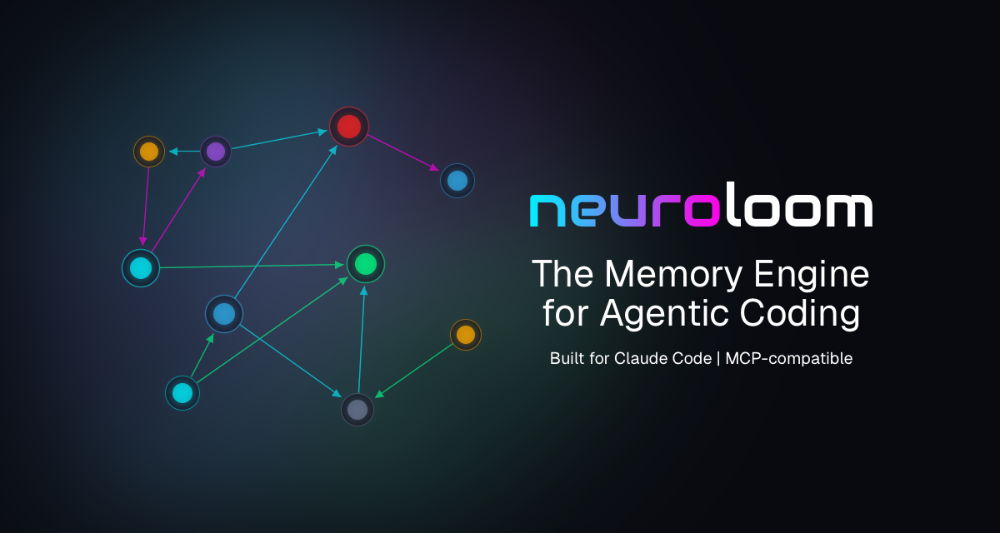

<p align="center">
  
</p>

# Neuroloom SDLC Plugin

Whatever you're doing right now is your SDLC. It might be structured or it might be vibes - either way, that process knowledge lives somewhere: some paper, Obsidian, in a project management tool or even in your own head. But Claude Code starts every session from scratch.

This plugin syncs your development process to [Neuroloom, the memory engine for agentic coding](https://neuroloom.dev). Specs inform future plans. Decisions surface when relevant. The process-layer memory enriches your development workflow by making the knowledge that would normally live in scattered files or an external system available outside the confines of a context window.

*Built on cc-sdlc, an open-source process framework for Claude Code. Use the full structure or just the parts that fit. There's no one right way to run a dev process — this just makes sure yours survives a context clear.*

---

## Prerequisites

- [**Neuroloom API key**](https://app.neuroloom.dev/settings/api-keys)
- [**neuroloom-claude-plugin**](https://github.com/endless-galaxy-studios/neuroloom-claude-plugin)

---

## Install

### 1. Install Neuroloom

Follow the instructions [here](https://github.com/endless-galaxy-studios/neuroloom-claude-plugin?tab=readme-ov-file#installation) to install `neuroloom-claude-plugin`, if you haven't already.

### 2. Install the Neuroloom SDLC

```
/plugin install neuroloom-sdlc@endless-galaxy-studios
```

### 3. Restart Claude Code, then initialize or port your workspace

**New project (no existing development process framework):**

```
/sdlc-initialize
```

**Existing project (cc-sdlc already installed locally):**

```
/sdlc-port
```

### To upgrade:
```
/sdlc-migrate
```

---

## What cc-sdlc is

cc-sdlc is an open-source process framework for Claude Code. It lives at `.claude/sdlc/` in your project and provides:

- **Skills** — orchestration commands (`/sdlc-plan`, `/sdlc-execute`, `/sdlc-lite-plan`, `/sdlc-idea`, `/sdlc-review`, etc.) that drive the spec → plan → implement → review lifecycle
- **Domain agents** — specialized subagents (backend-engineer, frontend-engineer, software-architect, search-engineer, etc.) that do the implementation and review work
- **Knowledge stores** — discipline-specific knowledge data (architecture patterns, testing gotchas, search engineering concepts) injected into agent dispatch prompts so agents don't rediscover the same lessons every session
- **Process rules** — the manager rule (the orchestrator never writes code), the review-fix loop (mandatory multi-agent review after every implementation), finding classification, collaboration model and deliverable lifecycle
- **Deliverable tracking** — every non-trivial unit of work gets an ID (D1, D2, ... Dnn), a plan, a result doc, and a catalog entry. Specs, plans, and results live in `docs/current_work/` while in progress; completed work moves to `docs/chronicle/`

The framework is sourced from [Inpacchi/cc-sdlc](https://github.com/Inpacchi/cc-sdlc). The plugin fetches from upstream at init and migrate time.

---

## What the plugin does

- **Knowledge tracking** — `/sdlc-initialize` fetches the cc-sdlc framework from upstream, parses its knowledge files (YAML entries, rules, gotchas, methodology), and ingests them into Neuroloom as tagged memories. Skills and agents reference this knowledge via semantic search instead of reading flat files — knowledge persists across sessions without loading everything into the context window.
- **Deliverable sync** — when Claude Code writes or edits a spec, plan, or result doc under `docs/current_work/`, the PostToolUse hook ships the content to Neuroloom in the background. Specs from a previous session are searchable in the next — decisions made during planning surface automatically when related code is touched later.
- **Framework version tracking** — the SessionStart hook checks whether a cc-sdlc framework update is available and prints a one-line notice when one is. Updates never apply automatically; you control when to run `/sdlc-migrate`.

---

## Contract with cc-sdlc

This plugin is an **adapter** for cc-sdlc — it transforms cc-sdlc's file-based knowledge references into Neuroloom's `memory_search`/`memory_store` calls at install and migration time. The transformation relies on a phrasing contract that cc-sdlc commits to upholding.

**Source of truth:** [`cc-sdlc/process/knowledge-routing.md` § "Adapter Plugins and the Phrasing Contract"](https://github.com/Inpacchi/cc-sdlc/blob/main/process/knowledge-routing.md)

**What the contract means in practice:**

- cc-sdlc skills use a small set of standard phrases when referencing the knowledge layer (e.g., `consult [sdlc-root]/knowledge/agent-context-map.yaml`). The exact phrases are listed in the contract doc above.
- This plugin's `/sdlc-migrate` skill contains a transformation table that matches those phrases and replaces them with Neuroloom calls.
- When cc-sdlc introduces a new knowledge-access phrase, it tags the changelog entry with `[contract-change]`. `/sdlc-migrate` scans for these on every upstream pull and flags them for the maintainer before applying the migration.

**Keeping the plugin in sync:** Changes to the contract are driven by cc-sdlc upstream. When this plugin is pulling a new cc-sdlc release, `/sdlc-migrate` reports any `[contract-change]` commits in the range being migrated. Resolve those (update the transformation table) before completing the migration.

### Transformation Scope

This plugin **overrides** only three cc-sdlc skills with Neuroloom-native versions: `/sdlc-initialize`, `/sdlc-migrate`, and `/sdlc-port`. All other cc-sdlc skills (`sdlc-plan`, `sdlc-execute`, `sdlc-tests-create`, etc.) ship from upstream unchanged.

However, those non-override skills contain references to file-based knowledge (e.g., `consult [sdlc-root]/knowledge/agent-context-map.yaml`) that need to become `memory_search` calls in a Neuroloom workspace. The plugin handles this via **content transformation at install/migration time**, not by overriding the skills:

| Lifecycle Moment | What Happens |
|------------------|--------------|
| `/sdlc-initialize` | Fetches cc-sdlc from upstream, transforms skill/agent/process files via the Pattern Mapping rules, writes transformed versions to `.claude/` |
| `/sdlc-migrate` | Pulls newer cc-sdlc, applies Pattern Mapping rules while preserving any `memory_search(` / `memory_store(` calls already present in the project copy |
| `/sdlc-port` | Converts an existing file-based cc-sdlc install into a Neuroloom workspace, applying Pattern Mapping in bulk |

Which files need transformation is determined at runtime by scanning each upstream file for phrasing-contract anchors (`[sdlc-root]/knowledge/`, `[sdlc-root]/disciplines/`, `consult [sdlc-root]/knowledge/`, `agent-context-map.yaml`). See `skills/sdlc-migrate/SKILL.md` § "Detecting Files That Contain Phrasing-Contract Patterns" for the algorithm and special-case overrides.

### Integrity Gates

Each of the three operations runs a post-operation audit (defined in `references/post-operation-audit.md`) as its final stage. The audit:

- Counts `memory_search(` / `memory_store(` calls across all installed files and verifies the Pattern Mapping targets landed
- Scans for residual cc-sdlc standard phrases that should have been transformed
- Scans for inline adapter conditionals that violate the contract
- Verifies manifest-to-filesystem hash consistency
- Confirms the Neuroloom sentinel is present and version-tagged

Any regression halts the operation before success is declared. `/sdlc-migrate` has two additional gates (pre-write and post-write) that catch MCP-preservation failures at the per-file level before the post-operation audit runs. This is defense-in-depth — the three gate layers protect against a 2026-04-22 regression where a migration silently reverted 65 MCP calls across 44 files by blindly overwriting project content with upstream.

---

## How It Works

All hooks are Python modules in `sdlc_pyhooks/`, launched via `run_hook.py`. The SDLC plugin has no dependencies of its own — it imports `pyhooks.config` and `pyhooks.http` directly from the base plugin. No local state database; hooks are stateless and call the Neuroloom API directly.

### Base plugin resolution

The SDLC launcher locates the base plugin using a four-step priority chain:

1. **`NEUROLOOM_CLAUDE_PLUGIN_ROOT` env var** — if set to a non-empty value, that path is used directly. Set this only when using a fork, an alternate org, or a non-standard install layout. Leave it unset for standard marketplace installs.
2. **Marketplace cache** — scans `~/.claude/plugins/cache/endless-galaxy-studios/neuroloom/*/` and selects the highest semver version. The org `endless-galaxy-studios` is hardcoded; the launcher does not auto-discover forks.
3. **Dev sibling** — `../neuroloom-claude-plugin` relative to the SDLC plugin root. Covers side-by-side development checkouts.
4. **Not found** — a diagnostic message is written to stderr and the hook exits cleanly.

Version selection from the glob uses integer tuple sorting (`0.10.0` correctly ranks above `0.7.0`), not lexicographic string sort.

### Degradation signal

If the base plugin cannot be located, `run_hook.py` writes a single line to stderr and exits. This happens before any Python hook runs, so there is no stdout banner (unlike the base plugin's codeweaver degradation banner, which fires from inside the session_start hook). The stderr line is visible in Claude Code's debug output but not in the transcript — this asymmetry is intentional. The SDLC plugin's failure mode (base plugin not found) is a configuration issue, not a transient install problem, so the signal is diagnostic rather than user-actionable in the transcript.

### Python interpreter

When the base plugin's `.venv` exists, hooks run inside it. When it does not exist, the system Python that invoked the launcher is used as a fallback. On the fallback path, a single line is written to stderr (gated to the session_start module only — not on every hook dispatch).

### `--user` install footprint

If `neuroloom-codeweaver` is installed via the base plugin's `--user` fallback path, it lands in `~/.local/lib/...` on POSIX or `%APPDATA%\Python\` on Windows — in the system Python's user site-packages, not isolated to the plugin venv. This package is visible to any code running under the same interpreter.

**SessionStart** — calls the Neuroloom version proxy to fetch the latest cc-sdlc release version, then searches for the workspace's sentinel memory to determine initialization state.

- If no sentinel exists: prompts you to run `/sdlc-initialize`
- If the sentinel's `sdlc:seed-version:` tag differs from the latest release: prints a one-line update notice with the `/sdlc-migrate` command
- On any network error: silent exit — never blocks session startup

**PostToolUse (deliverable sync)** — fires after Write and Edit on files matching `docs/current_work/**/*.md`. Reads the file, extracts the deliverable ID (`d42_foo_spec.md` → `42`) and doc type (`_spec.md` → `spec`, `_plan.md` → `plan`, `_result.md` → `result`, `_COMPLETE.md` → `chronicle`) from the filename, tags the payload with `sdlc:deliverable:{id}` and `sdlc:doc:{type}`, and ships it to the Neuroloom documents ingest endpoint in a background thread. Exits in under 100ms — the sync thread continues after the hook returns (`daemon=False` with a 90ms join). If the API is unreachable or returns a non-2xx status, the payload is buffered in the local SQLite `event_buffer` table for automatic replay on the next session start.

---

## Reference


### Skill Inventory

| Skill | When to use |
|-------|-------------|
| `/sdlc-initialize` | New project — seeds development process knowledge from upstream and writes operational files |
| `/sdlc-port` | Project has a local framework installation — migrates local knowledge and deliverables to Neuroloom |
| `/sdlc-migrate` | Workspace already initialized — pulls latest framework release and re-seeds changed entries, with content-aware merging and project customization preservation |


### Tag Schema

All process-layer data in Neuroloom is organized via tags with the `sdlc:` prefix. These are the tags the plugin creates and queries:

| Tag | Purpose | Set by |
|-----|---------|--------|
| `sdlc:sentinel` | Marks the workspace sentinel memory (exactly one per workspace) | `/sdlc-initialize`, `/sdlc-port`, `/sdlc-migrate` |
| `sdlc:seed` | Marks memories created by the seed algorithm | `seed()` |
| `sdlc:seed-version:{version}` | Tracks which framework version a memory was seeded from | `seed()`, sentinel |
| `sdlc:knowledge-id:{id}` | Stable identifier for upsert deduplication | All ingestion paths |
| `sdlc:project-specific` | Protects memories from being overwritten or deprecated during re-seed | User (manual tag) |
| `sdlc:deprecated` | Marks entries removed from upstream framework (not deleted, just tagged) | `seed()` |
| `sdlc:deliverable:{id}` | Links a memory to a deliverable (e.g., `sdlc:deliverable:d17`) | PostToolUse hook |
| `sdlc:doc:{type}` | Document type: `spec`, `plan`, `result`, `chronicle` | PostToolUse hook |
| `sdlc:pattern:{name}` | YAML pattern type: `entries`, `gotchas`, `rules`, `methodology` | YAML parsers |
| `sdlc:triage:{marker}` | Discipline parking lot triage state | Discipline parser |
| `sdlc:project-context` | Workspace project profile (tech stack, conventions) | `/sdlc-initialize` |


### API Endpoints

The plugin communicates with these Neuroloom API endpoints:

| Method | Endpoint | Used by |
|--------|----------|---------|
| `POST` | `/api/v1/documents/ingest` | PostToolUse hook, `/sdlc-port` |
| `POST` | `/api/v1/documents/ingest/batch` | `/sdlc-initialize`, `/sdlc-migrate`, `/sdlc-port` |
| `GET` | `/api/v1/sdlc/cc-sdlc-version` | SessionStart hook |
| `DELETE` | `/api/v1/sdlc/cc-sdlc-version/cache` | `/sdlc-migrate` |
| `POST` | `/api/v1/memories/search` | SessionStart hook (sentinel lookup) |

All endpoints require `Authorization: Token <api_key>`. Workspace is resolved server-side from the API key.


### MCP Tools

The slash commands use these MCP tools (available when the base Neuroloom plugin is installed):

| Tool | Used by |
|------|---------|
| `document_ingest` | `/sdlc-initialize`, `/sdlc-port` (individual knowledge files) |
| `document_ingest_batch` | `/sdlc-initialize`, `/sdlc-migrate`, `/sdlc-port` (batch operations) |
| `sdlc_get_version` | `/sdlc-initialize`, `/sdlc-migrate` |
| `memory_search` | `/sdlc-migrate` (sentinel lookup), `/sdlc-port` (transformation matching) |

---

## Troubleshooting

**"workspace not initialized" on every session start**
Run `/sdlc-initialize` or `/sdlc-port` to create the sentinel memory.

**Hook scripts not firing**
Check that hooks are registered in your Claude Code settings. The base plugin's `.venv` is created automatically on first SessionStart — if it is absent, start a new Claude Code session and let it bootstrap. If startup fails, check that `python3` >= 3.11 is available on your PATH.

**Sync buffer growing**
The `event_buffer` table in `.neuroloom.db` accumulates payloads when the API is unreachable. Buffered payloads are replayed automatically on the next session start. To check the buffer size: `sqlite3 .neuroloom.db "SELECT COUNT(*) FROM event_buffer"`.

**Migrating from shell hooks**
If you previously configured Neuroloom via `~/.neuroloom/config.json`, you must reconfigure using Claude Code's plugin configuration. Run `/plugins configure neuroloom` to set the `CLAUDE_PLUGIN_OPTION_API_KEY` and `NEUROLOOM_API_BASE` environment variables. The Python hooks read configuration from environment variables via `pyhooks.config.load()`; the old `config.json` file is no longer read.
