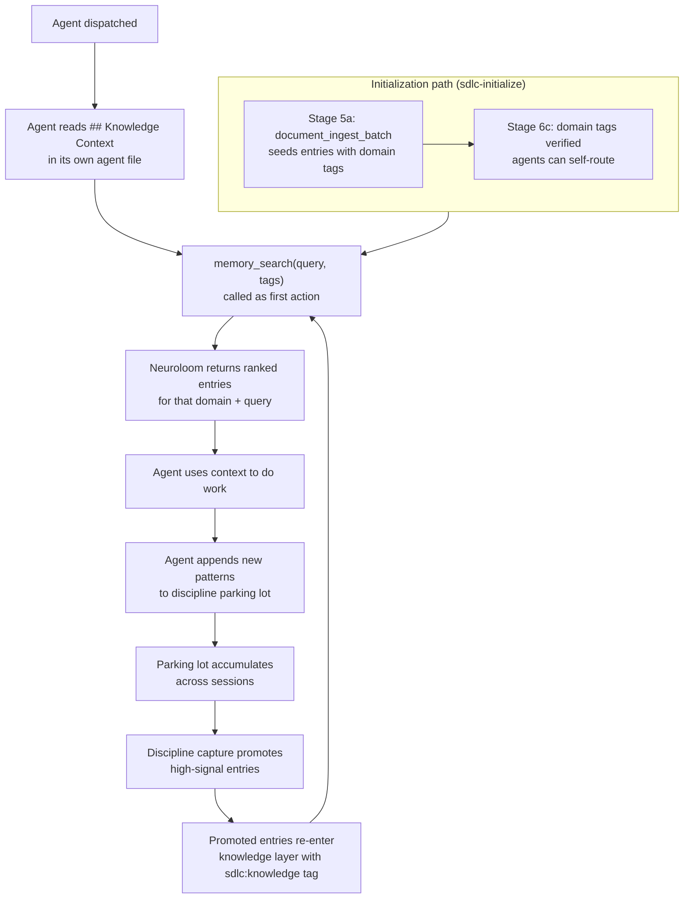

# Knowledge Routing — Neuroloom Implementation

This document is the single reference for how knowledge routing works in the Neuroloom SDLC plugin. Read it before modifying any `memory_search()` call, tag schema, or agent Knowledge Context section.

---

## Overview

In a file-based cc-sdlc installation, agents look up knowledge by reading YAML files at known paths — `ops/sdlc/knowledge/architecture/technology-patterns.yaml` being a typical example. The Neuroloom backend replaces that model entirely. Instead of reading files, agents call `memory_search()` with a natural-language query and domain tags, and Neuroloom returns the most relevant entries ranked by semantic similarity.

This matters for two reasons. First, relevance: a file read returns everything in the file regardless of how much of it applies to the current task. A search returns the entries closest in meaning to the query, so agents get fewer tokens of noise and more signal. Second, cross-domain discovery: a single search can surface entries that span multiple knowledge domains when the query meaning cuts across them — something a file path lookup cannot do at all.

The tag schema is the routing layer that sits on top of semantic search. Tags constrain results to the right knowledge scope; the query string does the relevance ranking within that scope.

---

## End-to-End Flow Diagram



**Initialization** is a one-time operation. `sdlc-initialize` seeds all knowledge entries into Neuroloom with the full tag schema (Stage 5a), then confirms that agents can search their domain knowledge (Stage 6c). After that, agents self-route without any orchestrator intervention.

**The feedback loop** is how the knowledge layer grows over time. Agents park new observations in discipline entries; those entries accumulate; a discipline capture pass promotes the high-signal ones back into the knowledge layer where they become retrievable by future agents.

---

## Tag-Based Routing

Every entry seeded by `sdlc-initialize` carries the following tags. The first five are always present; `sdlc:type:{type}` is conditional. Together they form the routing contract that lets agents find the right entries.

| Tag | Always present? | Value source |
|-----|----------------|--------------|
| `sdlc:knowledge` | Yes | Constant — marks this as a knowledge layer entry |
| `sdlc:seed` | Yes | Constant — marks it as seeded content (vs. discipline parking lot) |
| `sdlc:seed-version:{version}` | Yes | The cc-sdlc version resolved at initialization time |
| `sdlc:pattern:{pattern}` | Yes | From the YAML field — one of `entries`, `gotchas`, `rules`, `methodology` |
| `sdlc:domain:{domain}` | Yes | From the YAML domain field — see valid values below |
| `sdlc:type:{type}` | When present | From the YAML type field if the entry defines one |

### Valid Domain Values

These map directly to the subdirectories under `ops/sdlc/knowledge/` in the cc-sdlc source:

- `architecture`
- `business-analysis`
- `coding`
- `data-modeling`
- `design`
- `dx`
- `marketing`
- `product-research`
- `search`
- `testing`

A typo in a domain tag produces silent empty results — no error, just nothing returned. The troubleshooting section covers how to diagnose this.

### Cross-Domain Entries

Some entries are relevant to agents across multiple domains. A security pattern, for example, may belong to both `architecture` and `coding`. The correct approach is to tag the single entry with both domain tags:

```
tags: ["sdlc:knowledge", "sdlc:seed", "sdlc:domain:architecture", "sdlc:domain:coding", ...]
```

One entry with multiple domain tags — not duplicated entries with one tag each. Duplication means two entries to keep in sync every time the content changes.

### Before vs. After: File Path to `memory_search()`

The following table shows the cc-sdlc generic file-path pattern and its Neuroloom equivalent, drawn from the Pattern Mapping table in `sdlc-migrate/SKILL.md`:

| Generic (file-based) instruction | Neuroloom equivalent |
|----------------------------------|---------------------|
| `consult [sdlc-root]/knowledge/agent-context-map.yaml` (agent self-lookup at session start) | `memory_search(query="[agent-name] domain-specific patterns and conventions", tags=["sdlc:knowledge"])` |
| `Read [sdlc-root]/knowledge/architecture/agent-communication-protocol.yaml` | `memory_search(query="agent communication protocol handoff format progress updates", tags=["sdlc:knowledge", "sdlc:domain:architecture"])` |
| `Append to [sdlc-root]/disciplines/*.md` | `memory_store(tags=["sdlc:discipline:{name}", "sdlc:parking-lot"])` |
| `knowledge stores ([sdlc-root]/knowledge/)` | Neuroloom knowledge store, accessed via `memory_search()` |

`agent-context-map.yaml` is explicitly excluded from knowledge seeding. It is a configuration file that maps agent roles to file paths — a pattern that does not exist in the Neuroloom model. Ingesting it adds garbage to the knowledge layer. The Neuroloom replacement is the tag schema itself: agents route by calling `memory_search()` with domain tags, not by looking up their name in a map.

---

## Query String Design

The query string is a natural-language description of what you are looking for, not a keyword list. Treat it like you are asking a colleague: "What do we know about async SQLAlchemy session configuration?" not "sqlalchemy session config".

### Domain-Specific Query Heuristics

**architecture** — frame queries around decisions and trade-offs:
- `"FastAPI router design patterns and dependency injection conventions"`
- `"pgvector HNSW index tuning for cosine similarity search"`
- `"agent communication protocol handoff format"`

**coding** — frame around conventions and gotchas:
- `"TypeScript strict mode patterns and common type errors"`
- `"Python async/await code quality principles"`
- `"error handling conventions and domain exception hierarchy"`

**data-modeling** — frame around schema patterns and migration risks:
- `"SQLAlchemy async session configuration expire_on_commit"`
- `"embedding storage patterns and vector column types"`
- `"multi-tenant workspace isolation query patterns"`

**testing** — frame around test runner behavior and isolation:
- `"pgvector HNSW rollback gotchas in test cleanup"`
- `"pytest async fixture patterns and session scope"`
- `"vitest component test timing defaults"`

**search** — frame around retrieval strategy:
- `"hybrid search scoring and recall-precision trade-offs"`
- `"ingestion pipeline chunking and embedding generation"`
- `"ef_search tuning for high-recall similarity queries"`

**dx** — frame around API design and developer experience:
- `"SDK method naming conventions and self-documenting APIs"`
- `"OpenAPI spec enrichment patterns for code generation"`
- `"error message design with actionable next steps"`

### Precision and Recall Trade-offs

Adding more domain tags narrows the result set. If results are too few or too generic, try two adjustments:

1. **Broaden the query string** — use higher-level framing instead of specific terms.
2. **Drop the domain tag** — a query against only `sdlc:knowledge` searches across all domains, which recovers cross-domain entries that would otherwise be filtered out.

If you need entries from two domains in one call, the easiest option is to run two searches (one per domain) and merge. Alternatively, drop the domain tag and let query specificity do the narrowing.

---

## Domain Assignment

When a new agent is created after initialization, the agent author is responsible for writing the `## Knowledge Context` section with an appropriate `memory_search()` call. The steps are:

1. Identify which `ops/sdlc/knowledge/` subdirectory contains the knowledge most relevant to this agent's domain.
2. Write the `## Knowledge Context` section using the template pattern:

```
## Knowledge Context

Before starting substantive work, call:

memory_search(query="[agent-name] [primary domain] patterns, conventions, and gotchas", tags=["sdlc:knowledge", "sdlc:domain:{domain}"])

Read the returned entries before proceeding.
```

3. If the agent's domain spans two knowledge areas (e.g., a `fullstack-engineer` covers both `architecture` and `coding`), run a second search with the secondary domain tag, or drop the domain tag and use a specific query.

**At initialization time**, this work happens automatically. `sdlc-initialize` Stage 6 dispatches `/sdlc-create-agent` for each agent in the roster, which applies the Neuroloom agent template transformation — replacing the file-path Knowledge Context pattern with `memory_search()` calls using the appropriate domain tags. `Stage 6c` then verifies each agent can find its domain knowledge by running the search and confirming results come back.

---

## Memory Injection Timing

Knowledge is **not** pushed to agents automatically. There is no pre-session hook that reads all knowledge and injects it into context.

The `SessionStart` hook does run at the start of every session, but its job is narrow: check whether the sentinel exists and whether the workspace is at the current cc-sdlc version. If the sentinel is missing, it routes to `sdlc-initialize`. If the version is stale, it prompts to run `sdlc-migrate`. If everything is healthy, it does nothing to the knowledge layer.

The actual knowledge retrieval happens at dispatch time, triggered by the agent's own `## Knowledge Context` instruction. When an agent is dispatched, its first action is to call `memory_search()` as instructed in its system prompt. This is an **explicit pull**, not an automatic push.

The practical implication: knowledge is retrieved at the moment it is needed, scoped to the task at hand. An agent working on a database schema change calls `memory_search()` for data-modeling patterns. It does not receive architecture patterns, testing patterns, or anything else that isn't relevant to what it is about to do.

---

## Cross-Domain Sharing

Some knowledge is relevant to nearly every agent — the agent communication protocol is the clearest example. These entries get either broad domain coverage (multiple `sdlc:domain:` tags) or no domain tag at all (just `sdlc:knowledge`), making them retrievable from any domain search.

For an agent to find cross-domain entries, two options work:

1. **Second search without a domain tag.** After the primary domain search, run a second search with only `["sdlc:knowledge"]` and a query targeting cross-cutting content: `"agent communication protocol handoff format"`. This returns universal entries regardless of domain.

2. **Use query specificity.** If the query is specific enough, the semantic ranker surfaces the right entry even without a domain tag restriction. This works when the cross-domain entry is strongly associated with the query meaning.

The correct model is **one entry, multiple domain tags**. Creating a copy of an entry under each domain it belongs to is wrong — it means two entries to update every time the content changes, and the entries will eventually drift.

---

## Sentinel Metadata

The sentinel is a single memory entry in the knowledge layer tagged `sdlc:sentinel`. It is managed server-side by `seed()` and is readable by skills but never written to directly.

Read it with:

```
memory_search(query="SDLC workspace sentinel", tags=["sdlc:sentinel"])
```

The sentinel carries one critical tag: `sdlc:seed-version:{version}`. The `SessionStart` hook reads this tag to compare the workspace's seeded version against the latest cc-sdlc release. If they differ, the hook prompts for `sdlc-migrate`.

What the sentinel is **not**: it is not a mapping of agents to domains. It does not contain routing configuration. It is a health check anchor and a version anchor. The routing mechanism lives entirely in the `sdlc:domain:{domain}` tags on individual knowledge entries.

If the sentinel is absent, the workspace is not initialized. Do not create it manually — it is owned by `seed()`.

---

## Discipline Feedback Loop

Knowledge routing handles retrieval of existing knowledge. The feedback loop is how new knowledge enters the system.

The loop works in four steps:

1. **Agent appends.** After completing work, an agent stores new patterns, gotchas, or observations by calling `memory_store()` with `sdlc:discipline:{domain}` and `sdlc:parking-lot` tags. These entries sit outside the `sdlc:knowledge` scope — they are not returned by the standard knowledge routing searches.

2. **Parking lots accumulate.** Over multiple sessions, discipline entries pile up. They represent raw signal from real work: things that went wrong, patterns that worked, gotchas that bit someone.

3. **Discipline capture promotes.** Periodically, a discipline capture pass reviews the parking lot entries for a given domain. High-signal entries — those confirmed as reusable patterns or rules — get promoted.

4. **Promoted entries enter the knowledge layer.** Promotion adds `sdlc:knowledge` and the appropriate `sdlc:domain:{domain}` tag to the entry. From that point on, any agent running a knowledge search in that domain can retrieve the promoted entry. The loop is complete.

Entries that are too project-specific to be reusable stay in the parking lot or get tagged `sdlc:project-specific` to prevent them from being overwritten during re-seeding.

---

## Troubleshooting

When `memory_search()` returns no results, work through these checks in order:

**(a) Verify the sentinel exists.**

```
memory_search(query="SDLC workspace sentinel", tags=["sdlc:sentinel"])
```

If nothing comes back, the workspace was not initialized. Run `/sdlc-initialize`.

**(b) Verify the domain tag matches an initialized domain.**

Run a broad search without a domain tag:

```
memory_search(query="[your topic]", tags=["sdlc:knowledge"])
```

If this returns results and the domain-scoped search did not, you have a tag mismatch. The most common cause is a typo in the domain name — `sdlc:domain:architecure` vs `sdlc:domain:architecture`. Check the valid domain values listed in the Tag-Based Routing section above.

**(c) Broaden the query or drop the domain tag.**

If both searches return nothing, the knowledge for that topic may not have been seeded. Either:

- Drop the domain tag entirely and use a broad query to see what is in the workspace.
- Run `sdlc-initialize` again if large portions of the knowledge layer are missing (check `summary.unchanged` in the batch response — it should be high on a re-init if the workspace was healthy).

One search call always requires a query string. Tags alone are not sufficient — `memory_search` requires a `query` parameter on every call.

---

## Quick Reference

| Agent Role | Domain Tag | Example Query | Expected Entry Types |
|-----------|-----------|---------------|---------------------|
| `software-architect` | `sdlc:domain:architecture` | `"FastAPI routing patterns and SQLAlchemy async session configuration"` | Technology patterns, pipeline design, deployment patterns, API design methodology |
| `backend-engineer` | `sdlc:domain:architecture` (backend implementation patterns — FastAPI, SQLAlchemy, ARQ — live under the `architecture` domain in the cc-sdlc knowledge structure) | `"pgvector HNSW index configuration and ARQ job conventions"` | FastAPI patterns, SQLAlchemy patterns, pgvector patterns, ARQ job patterns |
| `sdet` | `sdlc:domain:testing` | `"pytest async fixtures and pgvector test cleanup gotchas"` | Testing paradigm, gotchas, tool patterns, timing defaults, advanced test patterns |
| `search-engineer` | `sdlc:domain:search` | `"hybrid retrieval scoring strategies and ingestion pipeline chunking"` | Retrieval strategy patterns, ingestion pipeline patterns, vector index tuning, score transform catalog |
| `dx-engineer` | `sdlc:domain:dx` | `"SDK method naming conventions and OpenAPI spec enrichment patterns"` | SDK design patterns, developer documentation patterns, agentic engine optimization |
| `frontend-engineer` | `sdlc:domain:design` | `"React component patterns and cyberpunk design system conventions"` | Component patterns, UX modeling methodology, design system, accessibility principles |
| `db-engineer` | `sdlc:domain:data-modeling` | `"embedding data modeling and common schema anti-patterns"` | Embedding data modeling, modeling anti-patterns, model health check, meta-framework patterns |
| `business-analyst` | `sdlc:domain:business-analysis` | `"SaaS monetization rules and startup unit economics"` | Monetization rules, financial modeling rules, market sizing rules, business model rules |
| `competitive-analyst` | `sdlc:domain:product-research` | `"competitive analysis methodology and data source evaluation"` | Competitive analysis methodology, dimension catalog, data source evaluation |
| `marketing-engineer` | `sdlc:domain:marketing` | `"GTM frameworks and brand strategy positioning rules"` | GTM frameworks, brand strategy rules, competitive monitoring, research methodology |
